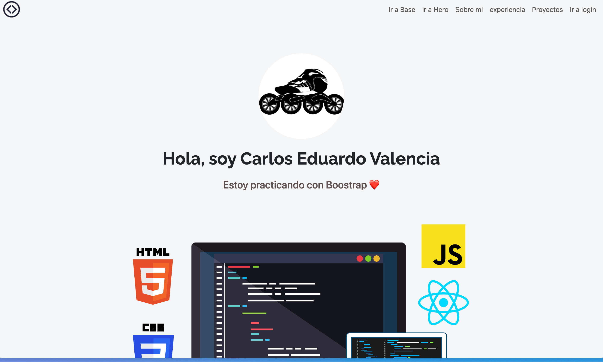

# Tareas de Topicos Avanzados
## Por: Valencia Hernández Carlos Eduardo ISIC G1

En esta actividad se practico flask usando una plantilla base que es el navbar, y en los enleces de la misma te lleva a las otras paginas de forma que se puede ir viendo la pagina en partes segun avanzas 

### Descarga esta rama para obtener mis archivos: Code > Download.zip o Da click en este enlace:
[Descargar esta rama](https://github.com/choterifa/Tareas-Topicos/archive/refs/heads/Practica-3-Jinjar.zip)
 

